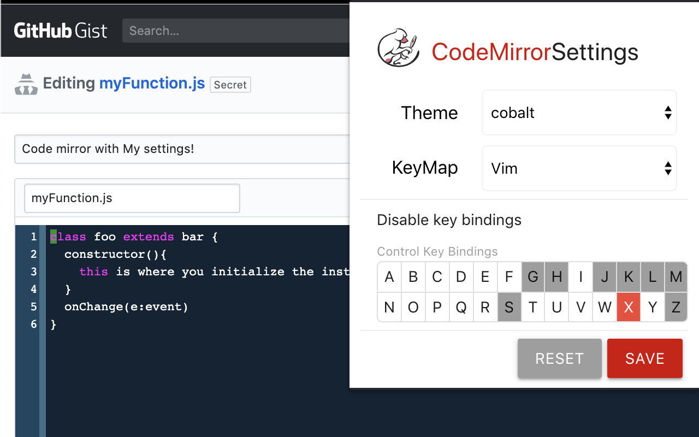

# CodeMirror Global Settings

Inject your favorite color theme or key bindings into every code mirror instance on the web!



###### To build the extension, use:

```bash
git clone https://github.com/jdthorpe/codemirror-global-settings.git
cd codemirror-global-settings
npm init
npm run build
```

The built extension is created in the `build` directory, and can be installed
locally by following [these instructions](
https://github.com/jdthorpe/codemirror-global-settings)


<!--
images were converted like so: 
homebrew install imagemagick
cd public/assets
magick -background none ./cm-icon.svg -resize 128x128 -format png ./cm-icon-128.png
magick -background none ./cm-icon.svg -resize 48x48 -format png ./cm-icon-48.png
magick -background none ./cm-icon.svg -resize 32x32 -format png ./cm-icon-32.png
magick -background none ./cm-icon.svg -resize 16x16 -format png ./cm-icon-16.png

clean up befor publishing: 

ls -aR build | grep '\(~\|swp\)$' | xargs rm -f
-->


